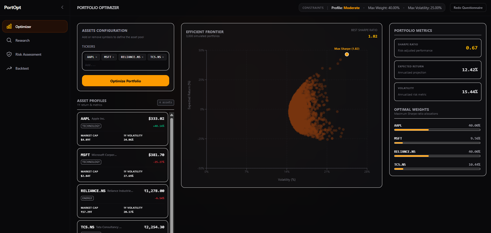
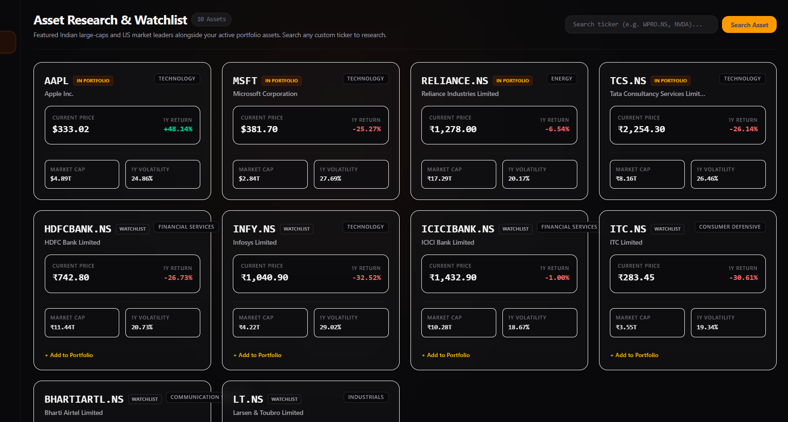
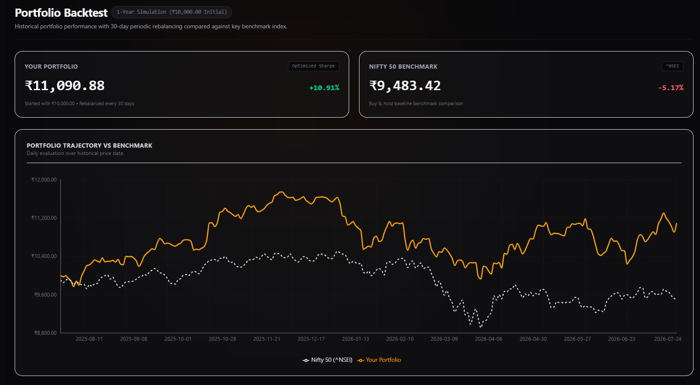

# Portfolio Optimizer — Modern Portfolio Theory Dashboard

A full-stack financial analytics platform that builds risk-calibrated stock portfolios using Modern Portfolio Theory — combining constrained optimization, Monte Carlo simulation, and historical backtesting in a dense, terminal-style dashboard. Supports both US and Indian equities.



## What it does

Most portfolio "optimizer" tutorials stop at a single Sharpe ratio calculation. This project goes further: it asks the user about their actual risk tolerance, constrains the optimization accordingly, and then backtests the result against a real benchmark index — so the output isn't just a number, it's a decision a user could act on.

**The pipeline:**
1. A 5-question risk assessment classifies the user as Conservative, Moderate, or Aggressive, translating that into concrete constraints (max allocation per stock, max portfolio volatility)
2. Historical price data is fetched for user-selected tickers (US or Indian markets)
3. A constrained numerical optimizer (SciPy SLSQP) finds the portfolio weights that maximize the Sharpe Ratio, subject to the user's risk constraints
4. A Monte Carlo simulation generates 3,000 random portfolios to visualize the full risk/return landscape and validate the optimizer's result
5. A historical backtest simulates the optimized portfolio's actual growth over the past year, with periodic rebalancing, benchmarked against the S&P 500 or Nifty 50 depending on the market

## Screenshots

| Research |
|---|
|  |

| Backtest vs Benchmark |
|---|
|  |

## Key technical decisions

- **Constrained optimization, not just unconstrained Sharpe maximization** — real investors have risk limits. The optimizer accepts `max_weight` and `max_volatility` parameters and fails gracefully (clear error, not a silent bad result) when a user's constraints are mathematically infeasible for their chosen stocks.
- **Monte Carlo as validation, not just visualization** — the best Sharpe ratio found by 3,000 random simulations independently converges on the same result as the SciPy optimizer, which is a useful sanity check that the optimizer is actually finding the true optimum rather than a local artifact.
- **Periodic rebalancing in the backtest**, not naive buy-and-hold — every 30 days, the simulated portfolio is rebalanced back to target weights, which is how real funds operate and materially changes the return profile versus letting weights drift.
- **Dual-market support** — ticker parsing automatically detects Indian equities (`.NS` suffix) and switches both the benchmark index (Nifty 50 vs S&P 500) and currency formatting (₹ vs $) accordingly.

## Tech Stack

**Backend:** Python, FastAPI, NumPy, Pandas, SciPy, yFinance
**Frontend:** React, TypeScript, Vite, Tailwind CSS, Recharts, Axios

## Project Structure

```
portfolio-optimizer/
├── backend/
│   ├── main.py
│   ├── routers/        # API endpoints (stocks, portfolio)
│   ├── services/        # data_fetcher, metrics, optimizer, monte_carlo, backtest
│   ├── models/           # Pydantic request/response schemas
│   └── requirements.txt
└── frontend/
    └── src/
        ├── api/          # Axios client
        ├── components/   # React components (per dashboard section)
        └── types/        # TypeScript interfaces
```

## API Endpoints

| Endpoint | Description |
|---|---|
| `GET /stocks/prices` | Historical price data for given tickers |
| `POST /stocks/info` | Per-ticker research data — sector, market cap, price, 1yr return, volatility |
| `POST /portfolio/optimize` | Max-Sharpe-ratio optimal allocation, with optional risk constraints |
| `POST /portfolio/simulate` | Monte Carlo simulation — 3,000 randomly weighted portfolios |
| `POST /portfolio/backtest` | Historical portfolio performance vs benchmark, with periodic rebalancing |

## Setup

### Backend
```bash
cd backend
python -m venv venv
venv\Scripts\activate   # or source venv/bin/activate on Mac/Linux
pip install -r requirements.txt
uvicorn main:app --reload
```
Visit `localhost:8000/docs` for interactive API documentation.

### Frontend
```bash
cd frontend
npm install
npm run dev
```

## What I learned building this

This was my first project combining quantitative finance with a full-stack build, and a few things stood out:

- **Numerical optimization is different from the ML I'd done before** — this wasn't about training a model on data, it was about using SciPy's constrained optimizer (SLSQP) to solve a well-defined mathematical problem: maximize Sharpe Ratio subject to real-world constraints like maximum allocation per stock. Learning to express portfolio limits as equality/inequality constraints, and to handle the case where those constraints make no valid solution possible, was a genuinely new way of thinking about a problem for me.
- **Validating one method against another builds real confidence in results.** Running Monte Carlo simulation alongside the SciPy optimizer wasn't just for the visualization — seeing thousands of random portfolios independently converge toward the same Sharpe ratio the optimizer found was the moment the math actually clicked as correct, not just code that ran without errors.
- **A "working" feature and a "trustworthy" feature aren't the same thing.** Adding explicit failure handling for infeasible constraints (instead of letting SciPy silently return a bad result) taught me that a lot of real engineering is about handling the cases where the happy path doesn't apply, not just building the happy path itself.
- **State management across a multi-page frontend is harder than it looks.** Keeping the Optimizer, Research, and Backtest pages all reading from a single consistent source of truth (so results don't go stale when navigating between them) was a recurring source of bugs, and fixing it properly taught me a lot about how shared state should actually flow through a React app.
- **Supporting more than one market (US and Indian equities) surfaces assumptions you didn't know you'd made** — currency formatting, benchmark selection, and even ticker parsing all needed to explicitly branch on market, rather than assuming a single currency or index throughout.